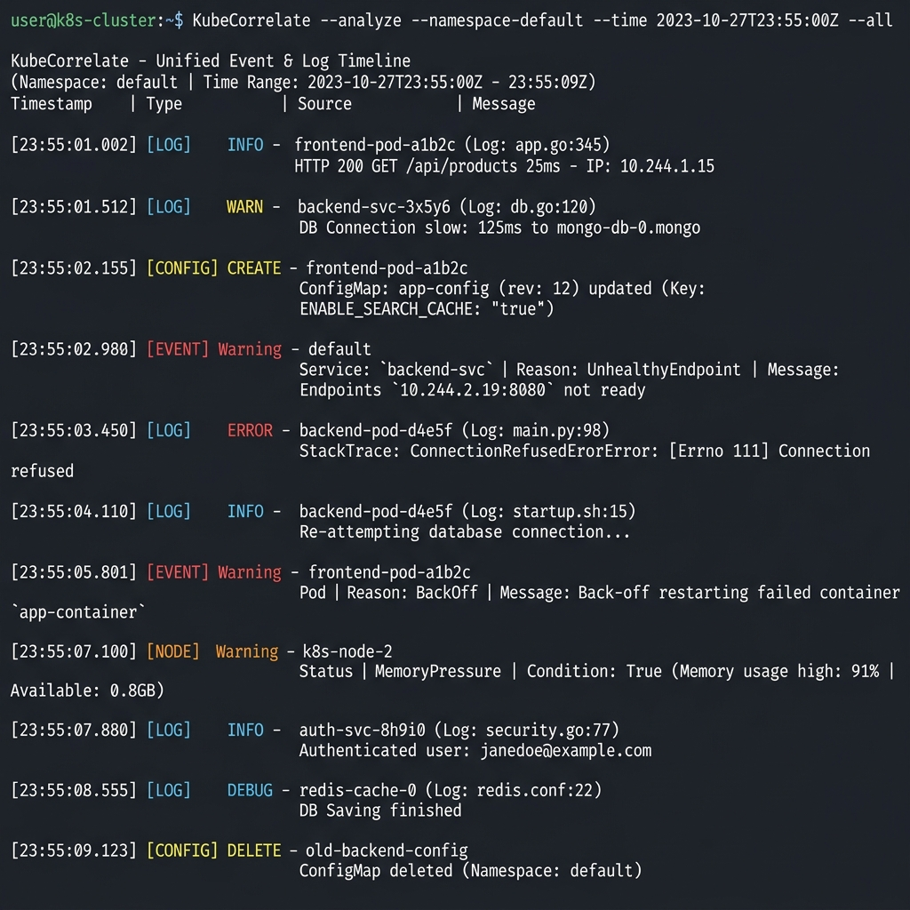
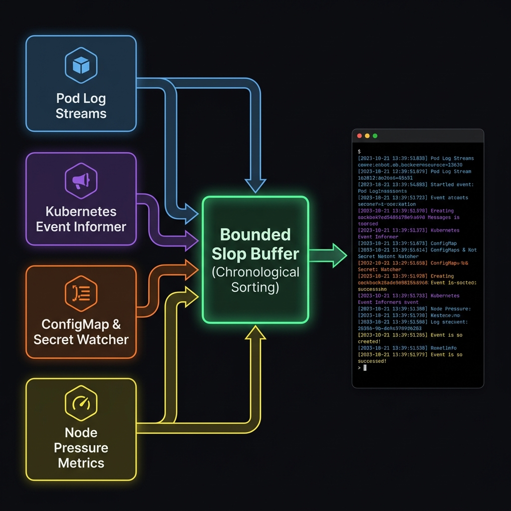

# KubeCorrelate

<p align="center">
  <a href="https://github.com/Dasmat13/kubecorrelate/actions/workflows/ci.yml">
    
  </a>
  <a href="https://github.com/Dasmat13/kubecorrelate/releases">
    
  </a>
  <a href="https://golang.org">
    
  </a>
  <a href="https://goreportcard.com/report/github.com/Dasmat13/kubecorrelate">
    
  </a>
  <a href="LICENSE">
    
  </a>
</p>

**KubeCorrelate** is a lightweight, single-binary Kubernetes troubleshooting CLI available through Krew. It combines container logs, Kubernetes events, configuration changes, and node-condition signals into one time-aligned terminal stream, helping operators identify likely root causes by showing logs, events, configuration changes, and node conditions on one chronological timeline without switching between multiple commands and tools.

---

## 🎨 Terminal Stream in Action



---

## 📖 Table of Contents

- [Features](#-features)
- [How it Works](#-how-it-works)
- [Prerequisites](#-prerequisites)
- [Installation](#-installation)
  - [Via Krew](#via-krew)
  - [Go Install](#go-install)
  - [From Releases](#from-releases)
  - [Building from Source](#building-from-source)
- [Usage & Examples](#-usage--examples)
  - [Command Options](#command-options)
  - [Quick Start Recipes](#quick-start-recipes)
- [Testing](#-testing)
- [Community & Contributing](#-community--contributing)
- [License](#-license)

---

## ✨ Features

* **Chronological Telemetry Stream:** Aligns container standard output (stdout/stderr) with warning events, configuration writes, and infrastructure health notifications.
* **Dynamic Pod Discovery:** Automatically tracks pod lifecycles. When containers crash, recreate, or roll out during deployments, KubeCorrelate dynamically connects to the new pod watches and tears down the old ones.
* **Bounded Slop Sorting Buffer:** Implements a client-side 1.5s asynchronous queue that guarantees chronological event ordering, preventing logs and events from interleaving out of order due to network and API latency.
* **Graceful RBAC Degradation:** Designed for locked-down clusters. If node or configuration watchers are forbidden, the tool outputs a single warning and keeps monitoring the remaining signals.
* **Timestamp Normalization:** Injects native RFC3339 timestamps and sanitizes output formats so logs from mixed language runtimes align perfectly.

---

## 🏗️ How it Works

KubeCorrelate operates purely client-side using the Kubernetes API server. It starts independent watching goroutines for each type of signal, queuing incoming items into a unified sorting multiplexer:



---

## 🚦 Prerequisites

- **Kubernetes Cluster**: Compatible with Kubernetes `v1.20+`.
- **Kubeconfig**: Valid credentials pointing to the target cluster (uses your active shell context or `$HOME/.kube/config`).

---

## 🚀 Installation

### Via Krew
You can install KubeCorrelate as a `kubectl` plugin via Krew:
```bash
kubectl krew install correlate
```
Once installed, invoke it using `kubectl correlate`.

### Go Install
Requires Go `1.22+` installed.

```bash
go install github.com/Dasmat13/kubecorrelate/cmd/kubecorrelate@latest
```

### From Releases
Download the compiled release binary for your platform from the [Releases Page](https://github.com/Dasmat13/kubecorrelate/releases).

```bash
# Example for Linux AMD64
VERSION=v0.1.5
curl -LO "https://github.com/Dasmat13/kubecorrelate/releases/download/${VERSION}/kubecorrelate_${VERSION#v}_linux_amd64.tar.gz"
tar -xzf "kubecorrelate_${VERSION#v}_linux_amd64.tar.gz"
sudo mv kubecorrelate /usr/local/bin/
```

### Building from Source
Requires Go `1.22+` installed.

```bash
# Clone the repository
git clone https://github.com/Dasmat13/kubecorrelate.git
cd kubecorrelate

# Compile the binary
go build -o bin/kubecorrelate cmd/kubecorrelate/main.go
```

---

## 🧪 Interactive Simulation Demo

Want to see KubeCorrelate debug real failures in real time? We provide a built-in simulator script that spins up a sandbox namespace with a `CrashLoopBackOff`, an `OOMKilled` pod, and a `Failed Rollout`.

1. **Spin up the simulated incidents:**
   ```bash
   ./scripts/simulate-incidents.sh
   ```

2. **Watch them correlate in real time:**
   ```bash
   # Run the plugin (using the compiled binary)
   ./bin/kubecorrelate -n kubecorrelate-demo
   ```

3. **Clean up the sandbox namespace:**
   ```bash
   kubectl delete namespace kubecorrelate-demo
   ```

---

## 📖 Usage & Examples

### Command Options

```text
Usage of kubecorrelate:
  -A                   Monitor all namespaces
  -buffer-delay string chronological sorting buffer delay (e.g. 1s, 1.5s, 3s) (default "1.5s")
  -filter string       Case-insensitive substring filter for container logs
  -f string            Case-insensitive substring filter for container logs (shorthand)
  -kubeconfig string   Absolute path to the kubeconfig file (defaults to ~/.kube/config)
  -n string            Kubernetes namespace to monitor (default "default")
  -l string            Label selector to filter pods (e.g. app=my-app)
  -p string            Regex pattern to filter pod names (e.g. ^auth-.*$)
  -since string        Stream logs since this duration (e.g. 5m, 1h, 24h) (default "10m")
```

### Quick Start Recipes

#### 1. Monitor a Microservice in the Default Namespace
Tail logs and events for all replicas of a specific app:
```bash
# Standalone binary
kubecorrelate -l app=order-processor

# Krew plugin
kubectl correlate -l app=order-processor
```

#### 2. Debug CrashLoops Across a Rolling Update
Monitor a rolling deployment in a specific namespace while filtering pod names:
```bash
# Standalone binary
kubecorrelate -n staging -p "^frontend-.*$" --since 30m

# Krew plugin
kubectl correlate -n staging -p "^frontend-.*$" --since 30m
```

#### 3. Monitor All Cluster Namespaces
Monitor all pods across all namespaces matching a label:
```bash
# Standalone binary
kubecorrelate -A -l tier=backend

# Krew plugin
kubectl correlate -A -l tier=backend
```

---

## 🛠️ Testing

Verify timestamp parsing and bounded-slop sorting algorithms locally:

```bash
go test -v ./...
```

---

## 🤝 Community & Contributing

We welcome contributions to KubeCorrelate! If you find a bug or have a feature suggestion, please open a Github issue or pull request.

Please review our [Contributing Guidelines](CONTRIBUTING.md) for details on our code of conduct, development patterns, and PR submission process.

---

## 📄 License

KubeCorrelate is licensed under the Apache License, Version 2.0. See the [LICENSE](LICENSE) file for details.
