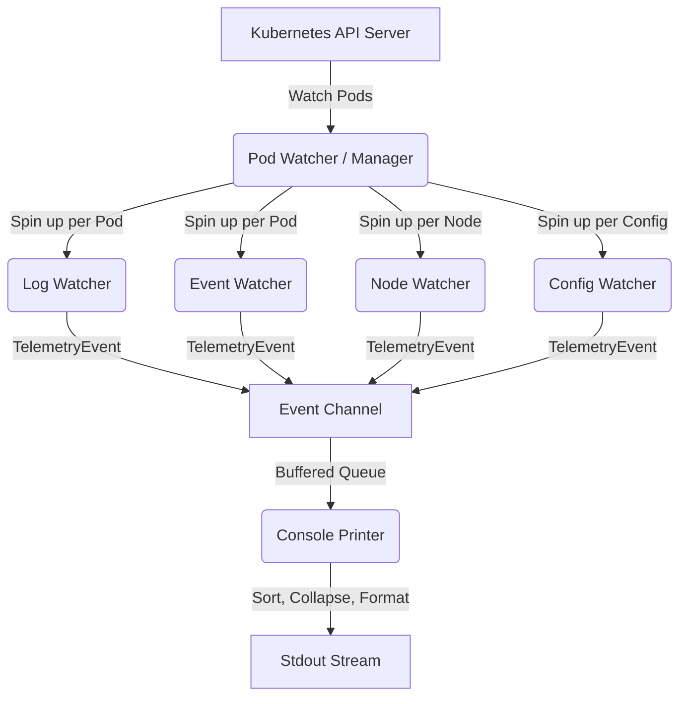

# KubeCorrelate Architecture & Internals

This document details the internal design and data flow of KubeCorrelate.

---

## 🏗️ Design Overview
KubeCorrelate is built around a concurrent, event-driven design to multiplex multiple Kubernetes telemetry streams into a single, time-aligned terminal stream.

---

## 1. Manager (`pkg/controller/manager.go`)
The Manager is the central controller. It is responsible for:
*   Subscribing to the core Pod watch stream.
*   Dynamically spawning/terminating child watcher goroutines as pods are added, modified, or deleted.
*   Aggregating events from all channels into a single central Go channel (`eventChan`).

## 2. Watchers (`pkg/watcher/`)
Each watcher runs in its own goroutine using client-go's watch API:
*   **Log Watcher:** Streams stdout/stderr with API-side timestamps enabled (`Timestamps: true`).
*   **Event Watcher:** Watches events matching `involvedObject.name=POD_NAME`.
*   **Node Watcher:** Watches node pressure events on the pod's scheduled node.
*   **Config Watcher:** Tracks changes to ConfigMaps and Secrets referenced in Pod volumes.

## 3. Console Printer (`pkg/printer/console.go`)
Since different watchers stream data concurrently, network latency would normally cause logs and events to print out of order.
To solve this:
*   The Console Printer buffers events in a slice.
*   Every `100ms`, it flushes all events that are older than the configured `buffer-delay` (default: `1.5s`).
*   Before flushing, it sorts the mature slice chronologically, collapses repetitive lines, and deduplicates repeated events.
